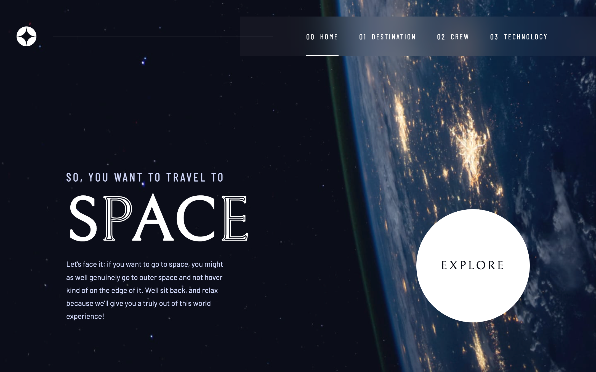
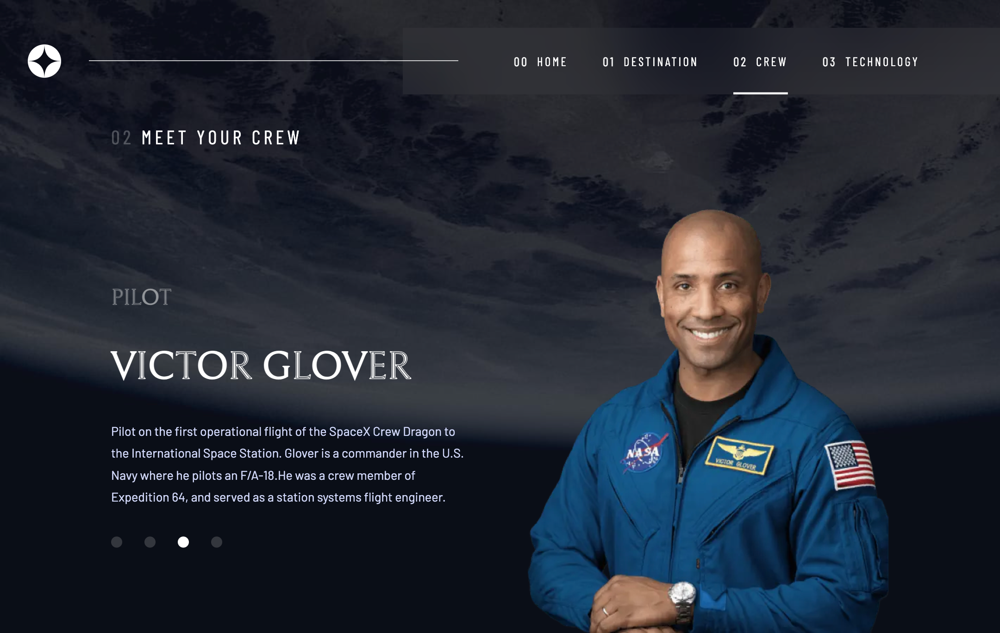
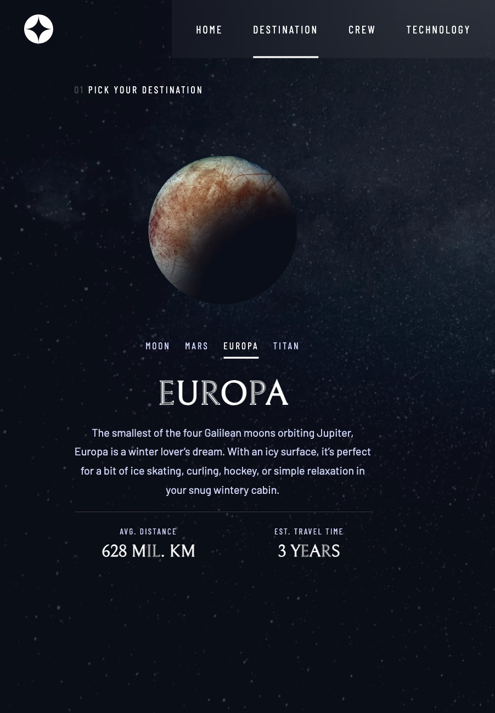

# Stellar Journey

## Table of contents

- [Stellar Journey](#stellar-journey)
  - [Table of contents](#table-of-contents)
  - [Overview](#overview)
    - [Screenshots](#screenshots)
    - [Links](#links)
  - [My process](#my-process)
    - [Built with](#built-with)
    - [What I learned](#what-i-learned)
    - [Continued development](#continued-development)
  - [Author](#author)

## Overview

### Screenshots

### Links

- Live Site URL: [stellar-journey.vercel.app](https://stellar-journey.vercel.app/)

## My process

### Built with

- React
- Next.js 13
- Typescript
- Zustand (state management)
- Custom SCSS code
- Flexbox/Grid
- Fluid design w/ rem, clamp, avoiding fixed media queries as much as I can
- Fetching data from local json

### What I learned

I used this project as an opportunity to **experiment with Next.js**. Although it might seem like over-engineering for this particular solution, it provided a project of the perfect size to **get familiar with the basic setup**. I also **explored its capabilities further by fetching data for each page separately**, while optimizing the **Server-Side Rendering (SSR)** features of Next.js.

What I really appreciate about Next.js is its **simplicity in implementing SSR**. By default, all components act as Server components (comparable to PHP templates for rendering the more static parts of your app), serving as a 'shell' for Client components. These can be easily activated with the 'use client' directive added to each respective component. As long as you adhere to the principle of "**User Interface components should be client-side, naturally**", and understand when to use Client or Server components, the architecture flows smoothly.

Another attractive feature of Next.js is the **ease of creating new pages with the built-in router** (even though this might be limiting for bigger applications and React Router is recommended; see **Continued development**) as well as defining an API with the built-in NextResponse function.

Venturing further into data fetching & manipulation, I implemented **Zustand**, a lightweight state management tool I used for the first time with this project. Its implementation is code-efficient and effective, allowing for persistent state within my project and the potential to easily build more complex features if needed later on.

In terms of styling, I opted for SCSS as it's my go-to tool. However, during the project I realized I could have achieved the same functionality with CSS custom properties, even though I do appreciate the structure SCSS file nesting allows. I'm still exploring better solutions.

When it comes to styling, I initially wrote all the styles using my prior knowledge. As I progressed through the project, I started learning about modern CSS concepts. This led to a complete overhaul of my CSS. I had already been using flexbox and grid, but I had been defining all units in pixels and wasn't taking full advantage of the accessibility features of my website. In my rewrite, I adopted the **Fluid design approach** where I converted almost all units to rem and even started using clamp to adapt my font and elements to all resolutions. I also minimized the use of fixed media queries.

### Continued development

- Add styled 404 page
- Add loading state for images
- Style the error state ("Failed to fetch data" message)
- Enhance persistent state by storing user choices in localstorage
- Implement React Router (the Next router can be limiting for future development)
- Implement testing with Jest and Cypress

## Author

- Frontend Mentor - [@vladmee](https://www.frontendmentor.io/profile/vladmee)
