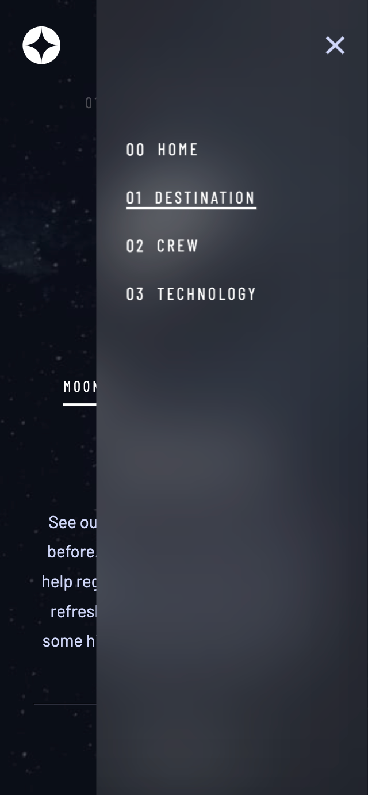

# Stellar Journey

## Table of contents

- [Stellar Journey](#stellar-journey)
  - [Table of contents](#table-of-contents)
  - [Overview](#overview)
    - [Screenshots](#screenshots)
    - [Links](#links)
  - [My process](#my-process)
    - [Built with](#built-with)
    - [What I learned](#what-i-learned)
    - [Continued development](#continued-development)
  - [Author](#author)

## Overview

### Screenshots

### Links

- Live Site URL: [vladmee.github.io/stellar-journey](https://vladmee.github.io/stellar-journey/)

## My process

### Built with

- React
- Next.js 13
- Typescript
- Zustand (state management)
- Custom SCSS code
- Flexbox/Grid
- Fluid design w/ rem, clamp, avoiding fixed media queries as much as I can
- Fetching data from local json

### What I learned

I took this opportunity to dive into **Next.js** and explore its capabilities. While I acknowledge that it might be considered overengineering for this particular solution, it was the perfect-sized project for me to delve into the basic setup. To push the boundaries a bit, I decided to **fetch data** for each page separately while still maintaining the full **SSR (Server-Side Rendering)** ability of Next.js.

One of the aspects I particularly enjoyed about Next.js is how straightforward it is to implement SSR. All components are, by default, **Server components**, acting as a "shell" to render the more static parts of your app. By simply adding the "use client" directive to the respective components, you can enable them as **Client components**. Adhering to the principle that "**User Interface components should be client-side, naturally**," the architecture flows seamlessly.

Another notable feature of Next.js is the ease of creating new pages using the **built-in router** (although for larger applications, React Router is recommended; see [Continued development](#continued-development)). Additionally, **defining APIs** is a breeze with the built-in NextResponse function.

During the development process, I decided to incorporate **Zustand**, a lightweight state management library, for the first time. Its implementation was concise and efficient, providing **persistent state **within the project and the flexibility to handle more complex features if required in the future.

While working on the styling, I opted for **SCSS** as my go-to tool. However, I soon realized that I could have achieved the same functionality using _CSS custom properties_. Although I appreciate the structuring capabilities of SCSS through its nesting feature (in comparison to CSS), I am actively exploring alternative solutions to optimize my workflow.

In terms of styling, I initially relied on my _prior knowledge_. However, as I progressed through the project, I began exploring **modern CSS concepts**. This led me to rewrite almost the entire CSS code (see [this commit](https://github.com/vladmee/stellar-journey/commit/0322d8a4ec774f351a011e5ff6b464ac51d06c8d)). I discovered the power of **fluid design**, converting most of the units to **rem** and utilizing **clamp()** to adapt fonts and elements to ALL resolutions, reducing the need for _fixed media queries_ to a minimum. It was a valuable learning experience, especially in terms of accessibility and responsiveness.

### Continued development

- Implement React Router
- Enhance persistent state
- Implement testing with Jest and Cypress

## Author

- Frontend Mentor - [@vladmee](https://www.frontendmentor.io/profile/vladmee)
